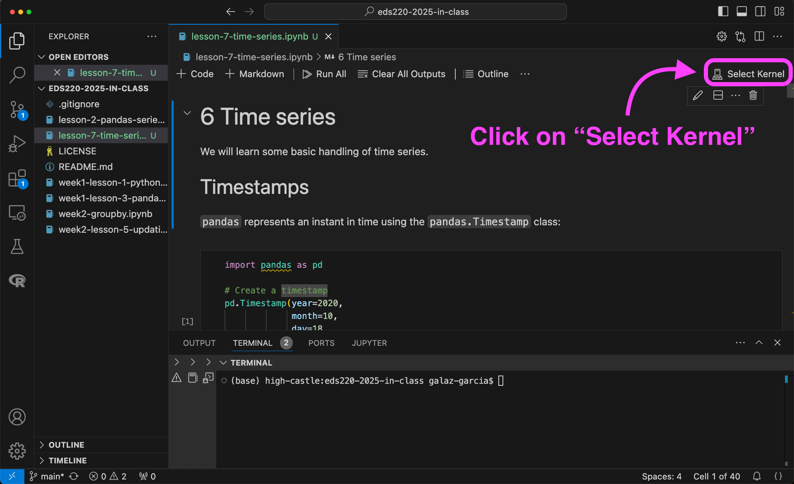
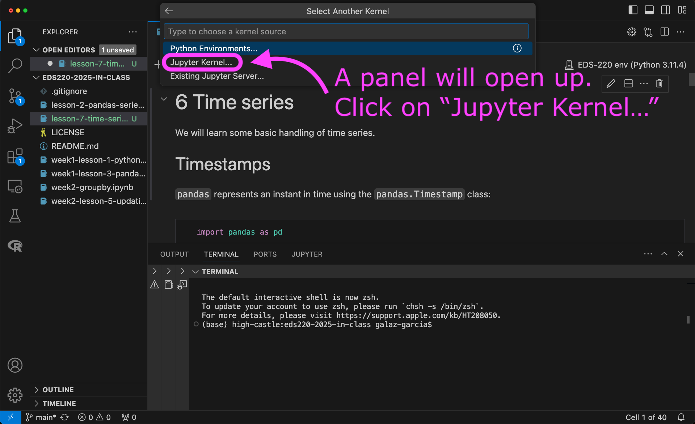
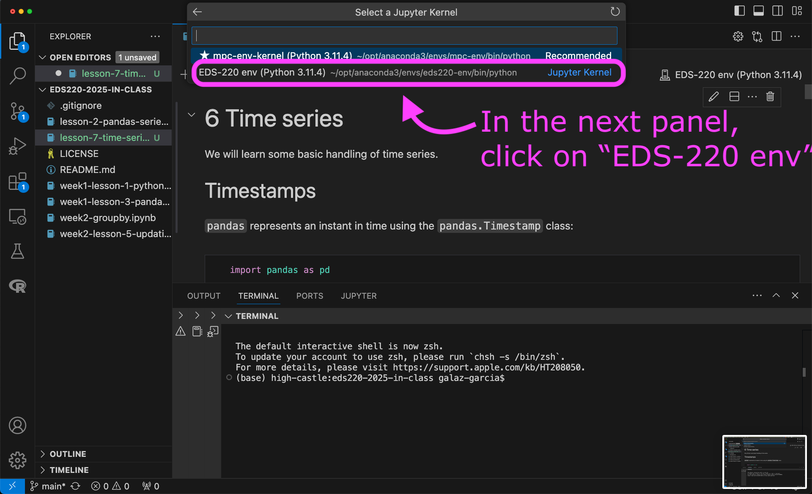

## Build conda environment

:::{.callout-important}
## Set up VSCode before moving on!

Make sure you have completed the [VSCode set-up](setup-vscode.qmd) before creating the environment.
:::

#

1. Open VSCode on your computer.

2. Download the following YAML file and move it into your `eds220-in-class` directory: [https://github.com/MEDS-eds-220/MEDS-eds-220-course/blob/main/eds220-env.yml](https://github.com/MEDS-eds-220/MEDS-eds-220-course/blob/main/eds220-env.yml)

3. Open a bash terminal inside VSCode and in it:

    a. Verify you are in the `eds220-in-class` directory. 

    b. Verify that the `eds220-env.yml` file is in the directory.

    c. Run the following conda command to build the environment used for the course:
    ```default
    conda env create --name eds220-env --file eds220-env.yml
    ```
    
It will take about 15 minutes to build the environment. Once conda has finished, verify that the environment was created by running `conda env list`. 

. Octocat is a registered trademark of GitHub, Inc.; the octocat images are not covered by this website's CC BY-NC 4.0 license.](images/nuxtocat.png){width="50%" fig-align="center"}

## Add Jupyter kernel

:::{.callout-important}
## Build the environment before moving on!
Make sure you have [built the `eds220-env`](setup-conda-env.qmd) before creating the kernel.
:::

1. Open VSCode on your computer.

2. Add a new bash terminal in it. 

3. Verify you have the `eds220-env` conda environment available by running
```bash
conda env list
```

4. Activate the `eds220-env` by running
```bash
conda activate eds220-env
```

5. Verify the environment has been activated. 

6. Run
```bash
python -m ipykernel install --user --name eds220-env --display-name "EDS-220 env"
```

7. Verify that the kernel has been created by running
```bash
jupyter kernelspec list
```
The output should look similar to this:
```bash
Available kernels:
  eds220-env        /Users/galaz-garcia/Library/Jupyter/kernels/eds220-env
  python3           /Users/galaz-garcia/opt/anaconda3/share/jupyter/kernels/python3
```

8. Close and reopen VSCode. 

9. To use the new kernel, open a Jupyter notebook on VSCode and...

{width=90%}

{width=90%}

{width=90%}

. Octocat is a registered trademark of GitHub, Inc.; the octocat images are not covered by this website's CC BY-NC 4.0 license.](images/labtocat.png){width="50%" fig-align="center"}
