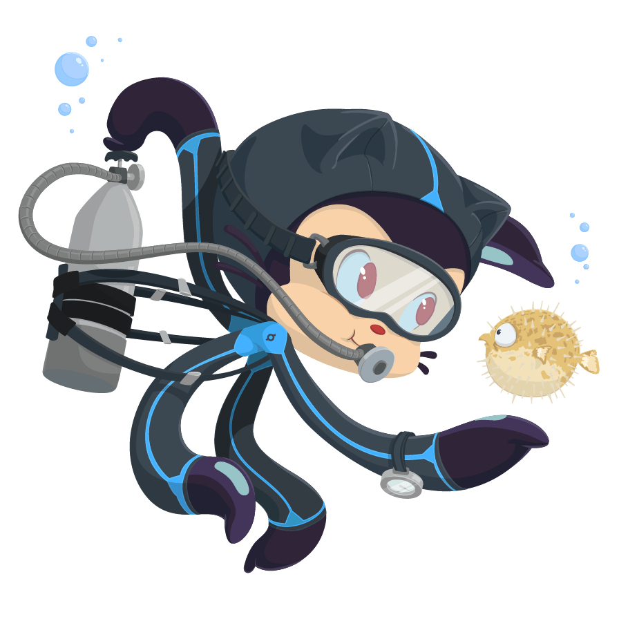
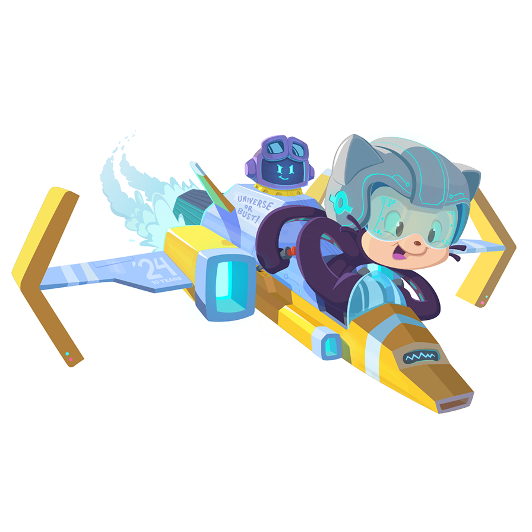
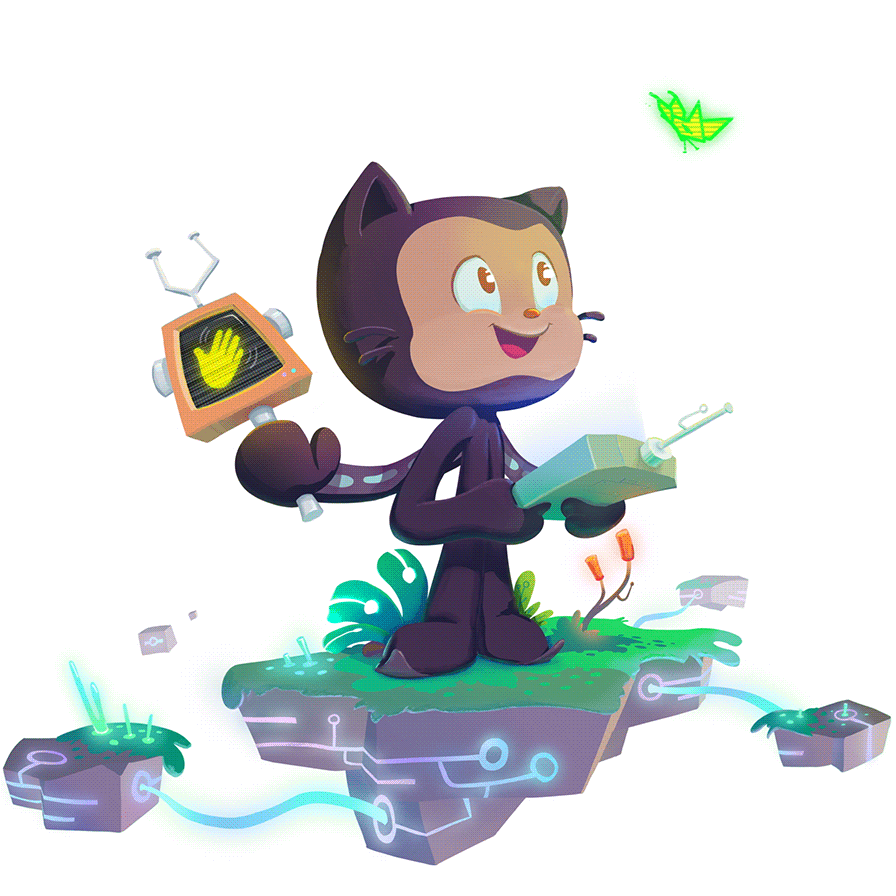

The following sections cover setups needed for the course. 

If you are not in MEDS and want to use these course materials, jump to steps 5 and 6. 

:::{style="text-align: center;"}
[{width="200px" fig-alt="Scubatocat octocat"}](setup-in-class-repo.qmd)

[1. Setup of GitHub repository for *discussion sections* coding sessions](/discussion-sections/ds0-sections-setup.qmd)
:::

:::{style="text-align: center;"}
[{width="200px" fig-alt="Scubatocat octocat"}](setup-in-class-repo.qmd)

[2. Setup of GitHub repository for *in-class* coding sessions](setup-in-class-repo.qmd)
:::

:::{style="text-align: center;"}
[{width="200px" fig-alt="Mona Lovelace octocat"}](setup-pat.qmd)

[3. Creating a PAT and storing it in the server](setup-pat.qmd)
:::

:::{style="text-align: center;"}
[{width="200px" fig-alt="Skatetocat octocat"}](setup-gitignore.qmd)

[4. Edit .gitignore file through terminal](setup-gitignore.qmd)
:::

:::{style="text-align: center;"}
[{width="200px" fig-alt="Universetocat octocat"}](setup-vscode.qmd)

[5. VSCode set-up](setup-vscode.qmd)
:::

:::{style="text-align: center;"}
[{width="200px" fig-alt="NUXtocat octocat"}](setup-conda-env.qmd)

[6. Build conda environment and add Jupyter kernel](setup-conda-env.qmd)
:::

 

:::{.text-muted style="text-align: center; font-size: 0.8em;"}
Octocats from the [GitHub Octodex](https://octodex.github.com): Scubatocat, Universetocat and NUXtocat by [cameronfoxly](https://github.com/cameronfoxly); Mona Lovelace and Manufacturetocat by [heyhayhay](https://github.com/heyhayhay); Skatetocat by [suziejurado](https://github.com/suziejurado); Labtocat by [JohnCreek](https://github.com/JohnCreek). Octocat is a registered trademark of GitHub, Inc.; the octocat images are not covered by this website's CC BY-NC 4.0 license.
:::
