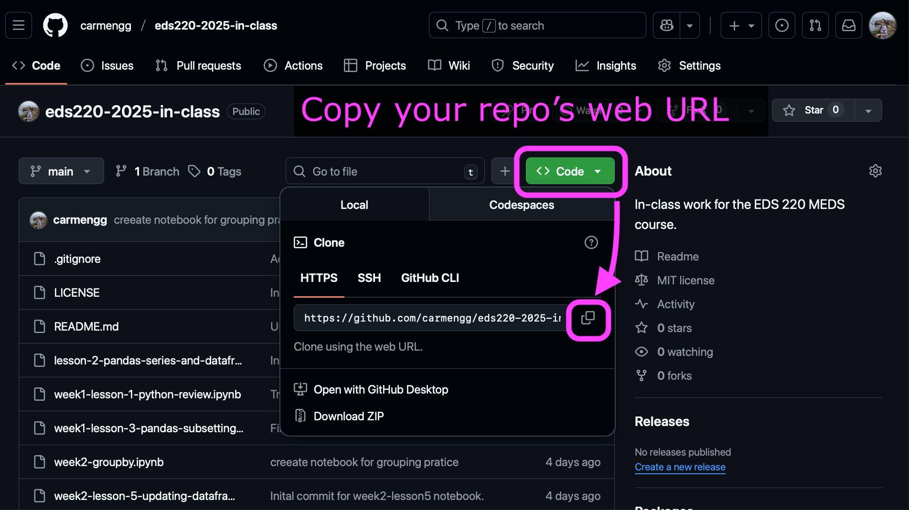
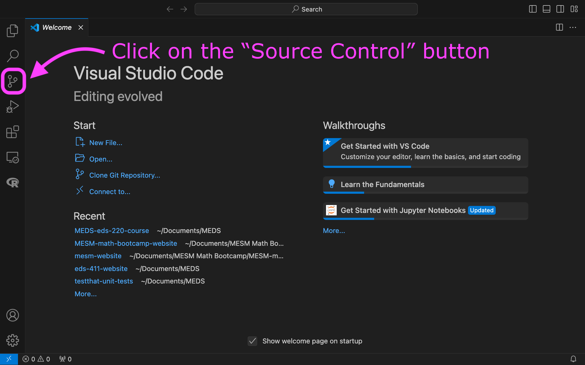
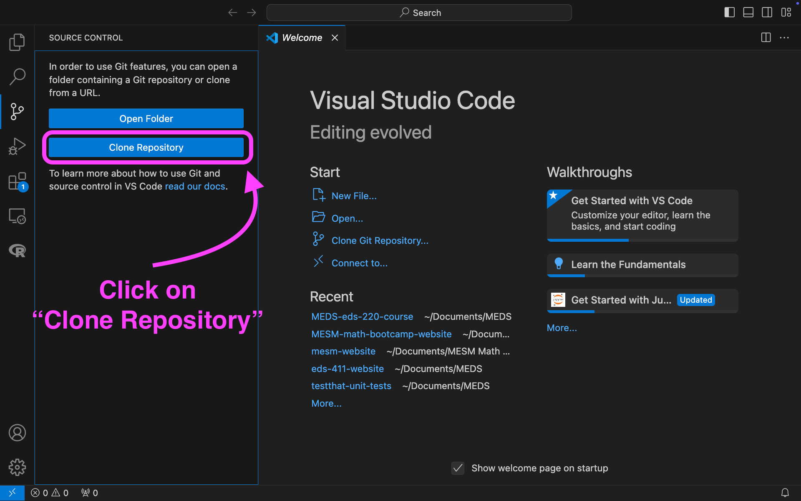
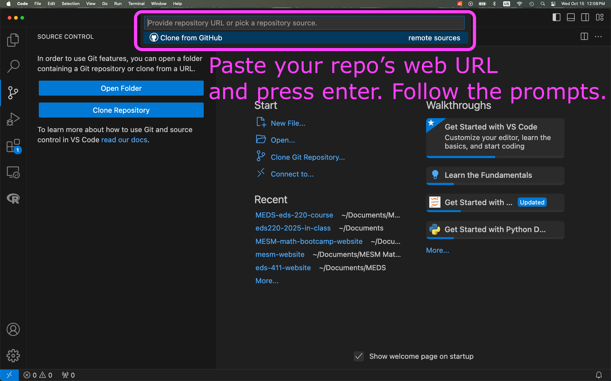
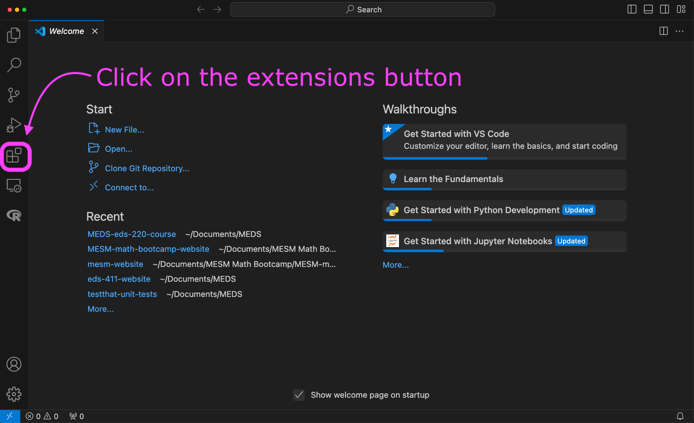
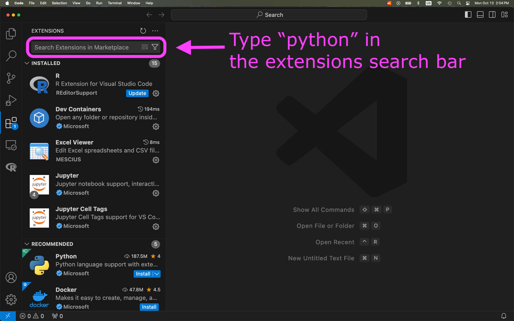
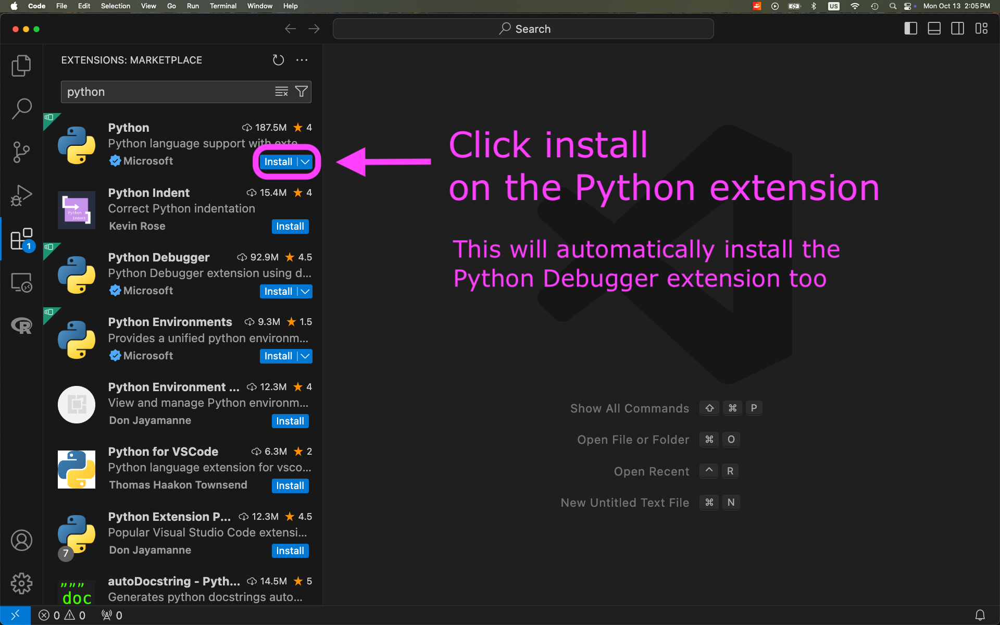

1. Create a `MEDS/EDS-220` directory in your personal computer.

2. Open VSCode.
  
3. Add a new **bash terminal** in it. 

4. Confirm git installation by running `git version` in the terminal. If git is installed you will get something similar to

```bash
git version 2.33.1
```

5. *If you don't get a similar output, install git by following the [MEDS installation guide](https://ucsb-meds.github.io/MEDS-installation-guide/#check-git).*
  
6. Clone your `eds220-in-class` repository inside the `MEDS/EDS-220` directory. You can do this using the terminal or using the VSCode interface:

{width=70%}

{width=70%}

{width=70%}

{width=70%}
  
7. Confirm your conda installation by running `conda info` in the terminal. If conda is active you will get something similar to

```bash
active environment : base
active env location : /Users/galaz-garcia/opt/anaconda3
shell level : 1

[...]

UID:GID : 502:20
netrc file : None
offline mode : False
```

8. *If conda needs to be added to the shell profile, follow the [troubleshooting steps](https://ucsb-meds.github.io/MEDS-installation-guide/#install-Anaconda) in the MEDS installation guide within a **bash terminal** (not Powershell if you are on Windows).*
  
9. Install Python extension to VSCode:

{width=70%}

{width=70%}

{width=70%}

. Octocat is a registered trademark of GitHub, Inc.; the octocat images are not covered by this website's CC BY-NC 4.0 license.](images/universetocat.png){width="50%" fig-align="center"}
