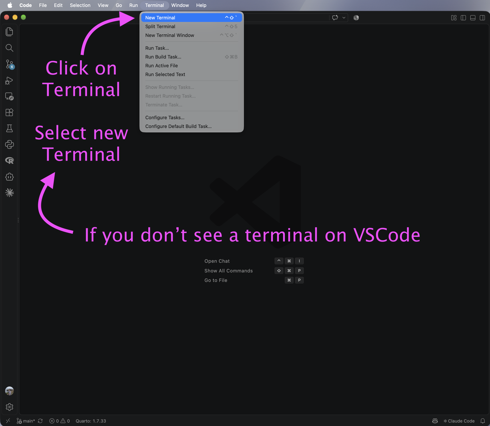
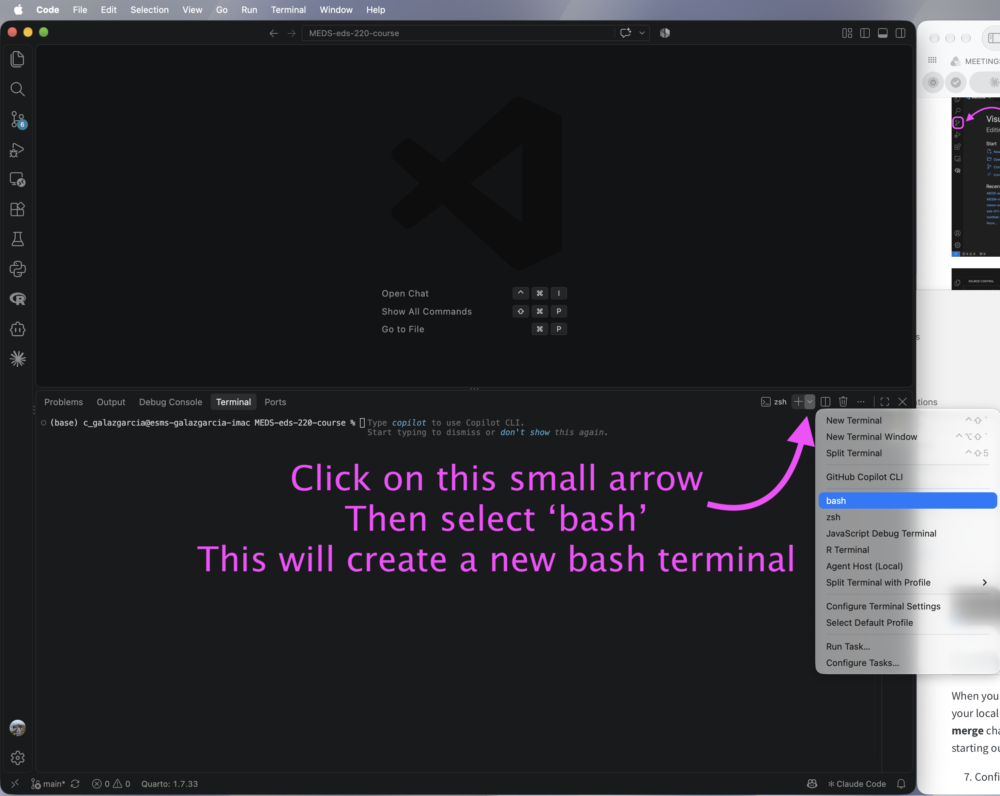
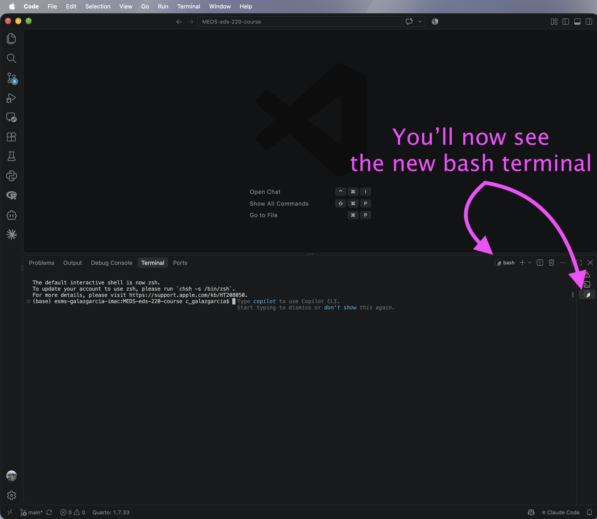
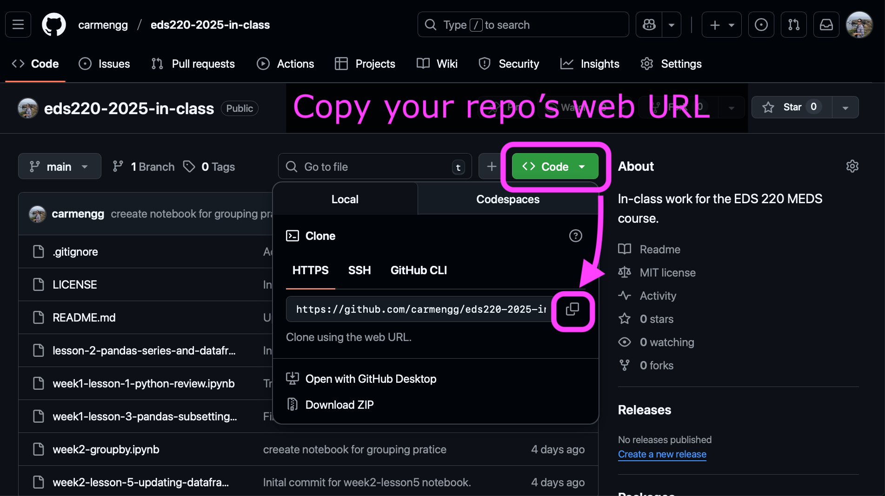
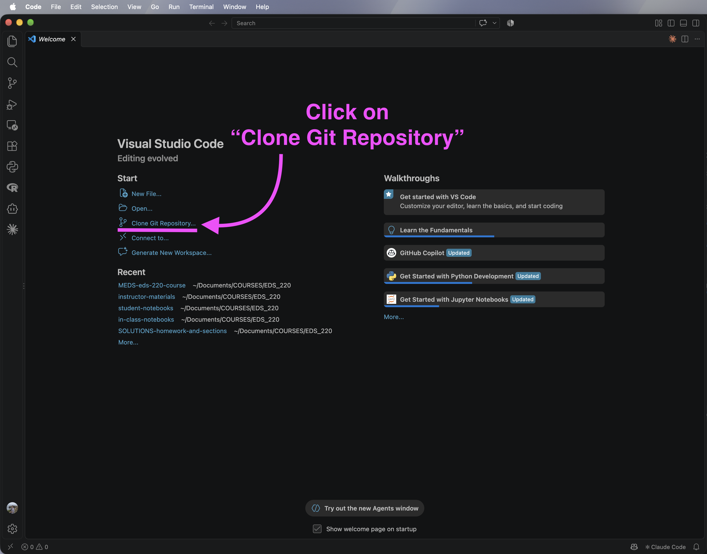
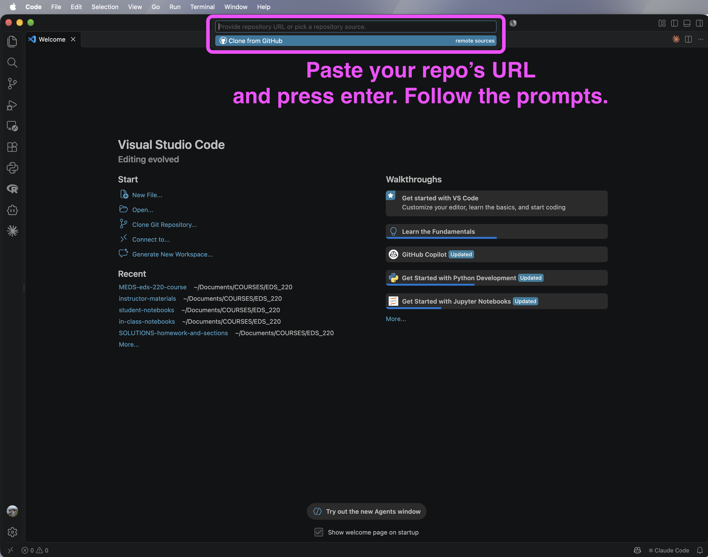
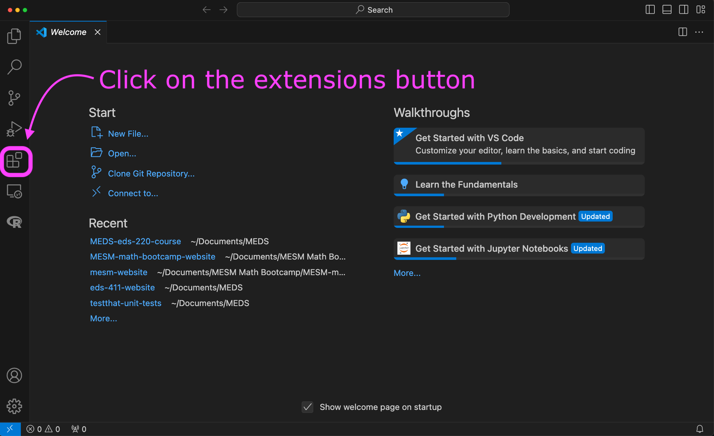
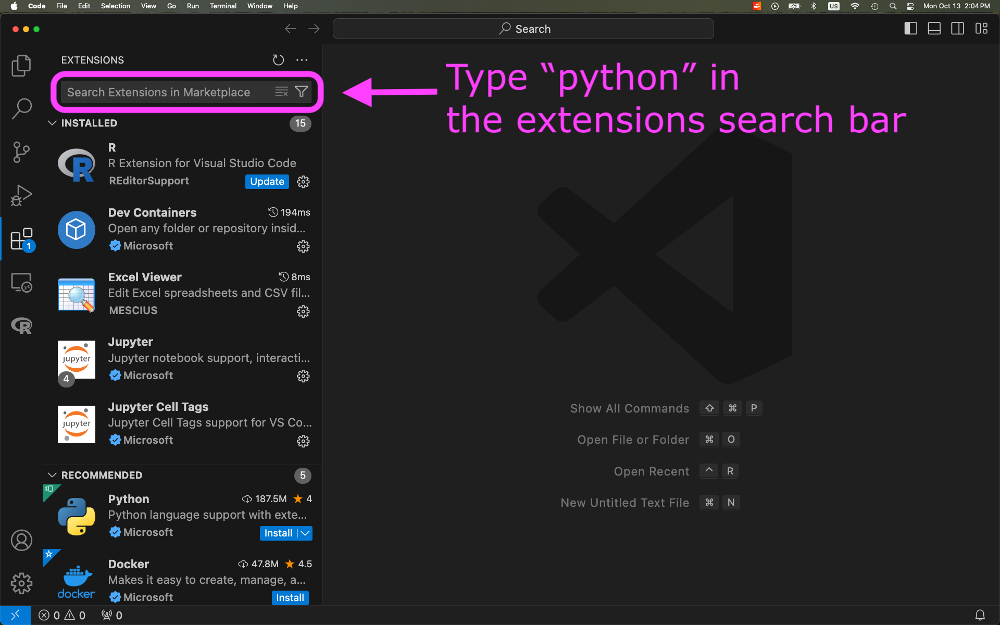
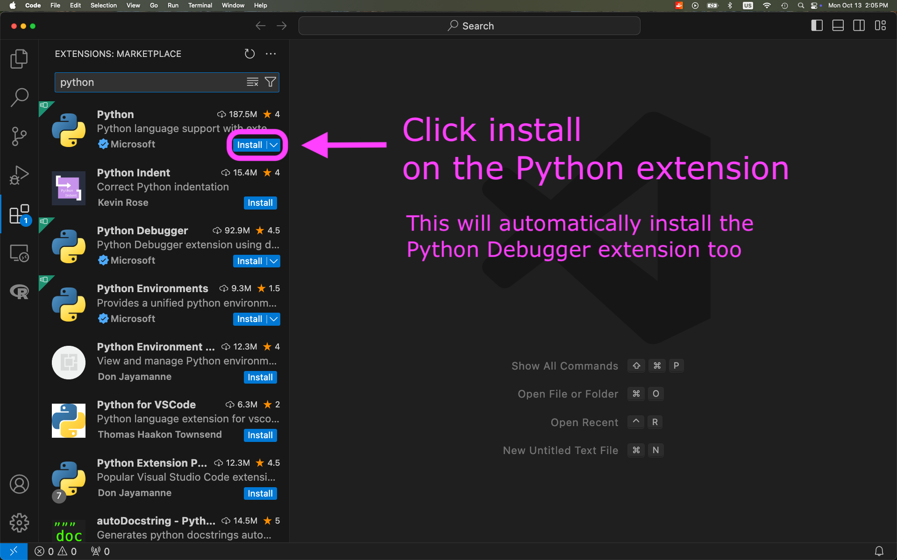

## First steps

1. Create a `MEDS/EDS-220` directory in your personal computer if you don't have one yet. 

2. Open VSCode.


## Confirm git installation
  
3. Add a new **bash terminal** in it. 

{width=70%}

{width=70%}

{width=70%}

4. Confirm git installation by running `git version` in the terminal. If git is installed you will get something similar to

```bash
git version 2.33.1
```

5. *If you don't get a similar output, install git by following the [MEDS installation guide](https://ucsb-meds.github.io/MEDS-installation-guide/#check-git).*

## Initialize your repository
  
6. Clone your `eds220-in-class` repository inside the `MEDS/EDS-220` directory. You can do this using the terminal or using the VSCode interface:

{width=70%}

{width=70%}

{width=70%}

## Configure `git pull.rebase`

7. Configure the way git handles `git pull` by running in the terminal:

```default
git config --global pull.rebase false
```

The `--global` option saves this setting for every repository on this computer, so you only need to run it once per computer.

8. Verify that your configuration was successful by running:
```default
git config --global --list
```

This command shows you all the settings git is using at the moment. Your output should look something like this:
```default
user.name=carmengg
user.email=c_galazgarcia@ucsb.edu
pull.rebase=false
```
If you see `pull.rebase=false` it means the configuration was successful.

## Check conda installation
  
9. Confirm your conda installation by running `conda info` in the terminal. If conda is active you will get something similar to

```bash
active environment : base
active env location : /Users/galaz-garcia/opt/anaconda3
shell level : 1

[...]

UID:GID : 502:20
netrc file : None
offline mode : False
```

10. *If conda needs to be added to the shell profile, follow the [troubleshooting steps](https://ucsb-meds.github.io/MEDS-installation-guide/#install-Anaconda) in the MEDS installation guide within a **bash terminal** (not Powershell if you are on Windows).*

## Install the VSCode Python extension
  
11. Install Python extension to VSCode:

{width=70%}

{width=70%}

{width=70%}

12. Install the Jupyter extension to VSCode. Similar steps as above!

. Octocat is a registered trademark of GitHub, Inc.; the octocat images are not covered by this website's CC BY-NC 4.0 license.](images/universetocat.png){width="50%" fig-align="center"}


