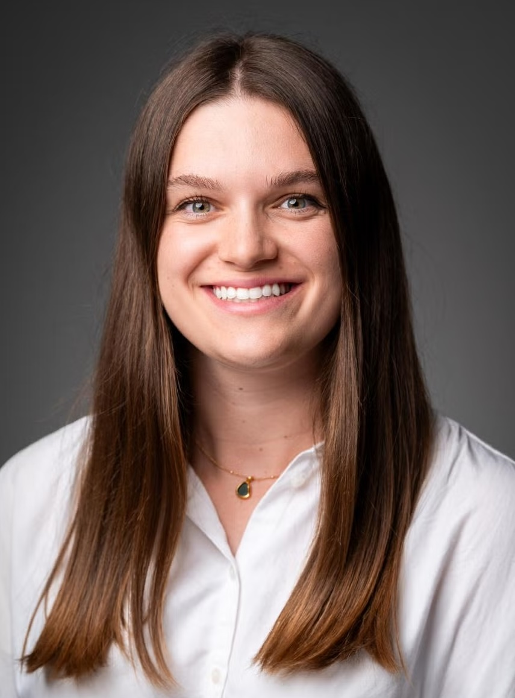
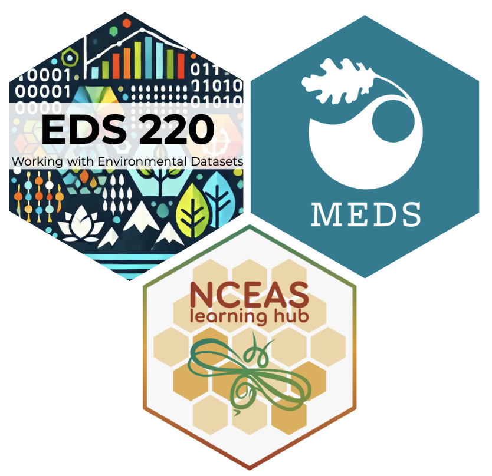
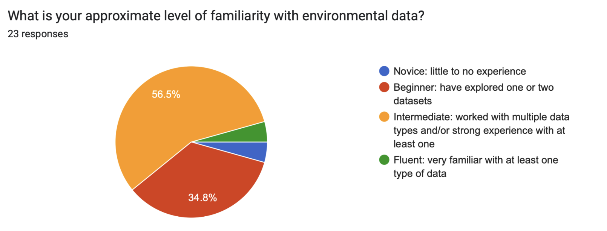
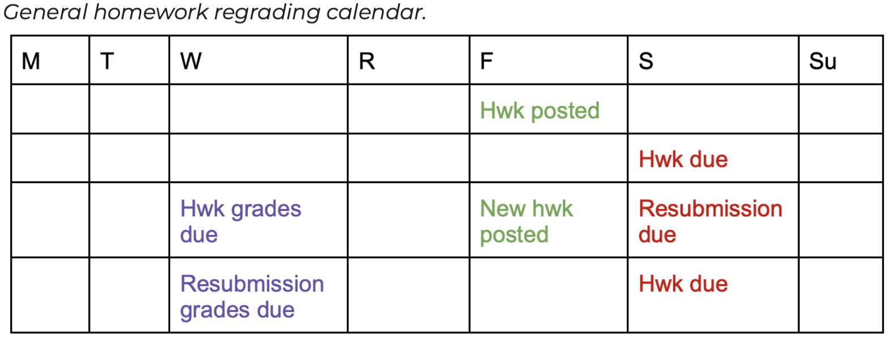
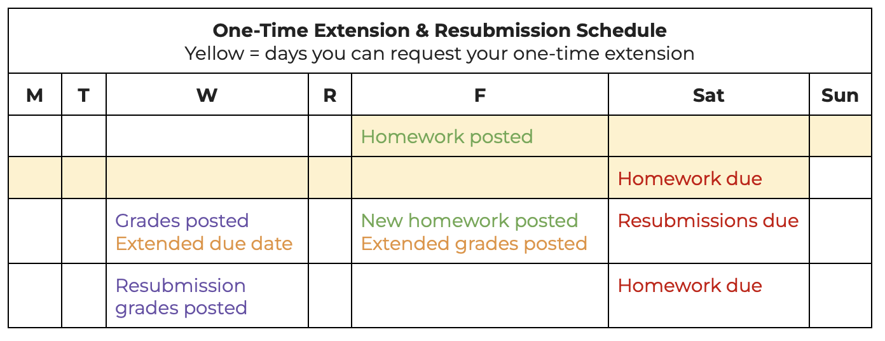

## {#title-slide data-menu-title="Title Slide" background="#053660"} 

[EDS 220: Working with Environmental Data]{.custom-title}

[*Course logistics*]{.custom-subtitle}

---

## {#welcome data-menu-title="Welcome to EDS 220!"} 

[Welcome to EDS 220!]{.slide-title}

This course focuses on hands-on exploration of widely-used environmental data formats and Python libraries. Together, we'll work with real-world datasets, giving you the skills to analyze and understand the environment around us.

::: {.cell layout-align="center"}
::: {.cell-output-display}
{fig-align='center' width=45%}
:::
:::

:::{.gray-text .body-text-s .center-text}
*Banner by [NASA's Your Name in Landsat](dsat.gsfc.nasa.gov/apps/YourNameInLandsat-main/)*
:::

---

## {#teaching-team data-menu-title="Teaching team"} 

[The teaching team]{.slide-title}

:::: {.columns}

::: {.column width="50%"}
**Instructor**

- Carmen Galaz García (she/her/hers)  
- E-mail: c_galazgarcia@ucsb.edu
- Student hours: Thursday 2-3 @ Bren Hall 4424

**Co-Instructor** 

- Annie Adams (she/her/hers)  
- E-mail: aradams@ucsb.edu
- Student hours: Tuesday 2-3 @ Bren Hall 3418
:::

::: {.column width="50%"}
{fig-align="center" width="40%"}

{fig-align="center" width="35%"}
:::

::::

---

## {#about-me data-menu-title="About me"} 

[Carmen: About me]{.slide-title}

:::: columns

::: {.column width="50%"}
- Assistant Teaching Professor @ Bren

::: {.fragment}
Before that:

- Data Scientist @ NCEAS
- Ph.D. in Mathematics @ UCSB
:::
::: {.fragment}
**Research:**

- Image analysis for invasive plant species detection
:::
::: {.fragment}
**Teaching:**

- Developing our MEDS Python curriculum!
- MEDS capstone courses
- Math and data science initiatives @ Bren
:::
:::

::: {.column width="50%"}

::: {.cell layout-align="center"}
::: {.cell-output-display}
{fig-align='center' width=100%}
:::
:::

:::
::::

---

##  {data-menu-title="# Introductions #" background="#047C90"}

 Introductions

*In the next few minutes, talk with a person next to you and ask them what parts of Santa Barbara have they enjoyed exploring.*

**You'll get to introduce your partner at the end.**

---

## {#learning-objectives data-menu-title="Learning Objectives"} 

[Learning Objectives]{.slide-title}

By the end of this course, you will be able to:

- Write Python code from scratch following best practices and adapt code others write.

 

- Manipulate various types of environmental data, including tabular, vector, and raster data, using established Python libraries.

 

- Find and access datasets from major public environmental databases.

 

- Produce effective reports that combine text and code to share their data analyses with colleagues. 

---

## {#schedule data-menu-title="Tentative Schedule"} 

[Tentative Schedule]{.slide-title}

---

## Class snapshot 1

---

## Class snapshot 2

---

## {#code-of-conduct data-menu-title="Code of Conduct"} 

[Code of Conduct]{.slide-title}

 
 

We expect all course participants (including instructors, guests, and students) to be committed to **actively creating, modeling, and maintaining an inclusive climate and supportive learning environment for all**. 

. . . 

 

We expect everyone to treat every member of our learning community with respect. 

. . . 

 

Everyone is expected to read and adhere to the [Bren School Code of Conduct](https://bren.ucsb.edu/media/4038/download) and the [UCSB Code of Conduct](https://www.sa.ucsb.edu/docs/default-source/default-document-library/conduct-code-fall-2020_final.pdf?sfvrsn=fada724f_0).

---

## {#accommodations data-menu-title="Access & Accommodations"} 

[Access & Accommodations]{.slide-title}

 

If you have any kind of disability, whether apparent or non-apparent, learning, emotional, physical, or cognitive, **you may be eligible to use formal accessibility services on campus**. 

. . . 

 

To arrange class-related accommodations, please contact the [Disabled Students Program (DSP)](https://dsp.sa.ucsb.edu/accommodations/how-apply). DSP will initiate communication about accommodations with faculty. 

By making a plan through DSP, appropriate accommodations can be implemented without disclosing your specific condition or diagnosis to course instructors.

---

## {#attendance data-menu-title="Attendance"} 

[Attendance]{.slide-title}

In-person attendance to classes and discussion sections is crucial!

If you miss a class you are expected to:

- 📩 **Be proactive:** Notify the instructor before it happens or within a day and provide a brief explanation. 

- 🔄 **Catch up:** Work with the instructors to review any missed material.

- 🤒 **Stay home when you are sick!** Prioritize your wellbeing. 

**Attendance does not count towards your grade, but it will be tracked and absences without communication will be addressed.** 

UCSB courses are taught in person, so absences for two or more weeks may require a Leave of Absence. 

There will not be **no option for remote attendance to class** except for the class before Thanksgiving break. 

---

## {#evaluation data-menu-title="Evaluation & Grading"} 

[Evaluation & Grading]{.slide-title}

 
::: {.center-text .body-text-m}
::: {.fragment}
**Grading Breakdown:**

- Homework: 75% (4 assignments)
- Portfolio: 20%
- Participation: 5%
:::
::: {.fragment}
**Grade Cutoffs:**

- A+ (≥ 97%), A (≥ 92%), A- (≥ 90%), 
- B+ (≥ 87%) , B (≥ 82%), B- (≥ 80%), 
- C+ (≥ 77%), C (≥ 72%), C-(≥ 70%), 
- D+ (≥ 67%), D (≥ 62%), D-(≥ 60%), 
- (60>) F. 
:::
:::

---

## {#homework data-menu-title="Homework Assignments"} 

[Homework Assignments]{.slide-title}

 
 

- There will be 4 homework assignments. 
- Assignments are assigned every other  Friday starting on week 1 and **should be submitted by 11:59 pm on next week’s Saturday**. 

 

- Working together and collaborating with peers on homework is highly encouraged! 
- Submissions are individual so make sure you understand everything you are turning in. 

---

## {#regrading data-menu-title="Regrading"} 

[Regrading]{.slide-title}

:::: columns

::: {.column width="50%"}
You can **resubmit your assignments three days after they have received initial feedback**. 

- In this second submission, you may recover up to 50% of the points not obtained during the initial submission. 
:::

::: {.column width="50%"}

:::
::::

**Why regrades?**
Revisions, corrections, and improvements are crucial in the learning process! We greatly encourage you to resubmit your revised assignments.

 

. . .

**Example:**
You submitted your homework on time on the due date and got a 6/10 in the assignment the coming Wednesday. You may build on the feedback received to correct your work and resubmit to improve your grade up to 8/10. 

Except for extenuating circumstances, **there will be ​no extension for any assignment.** Late submissions will be accepted at the resubmission date and can obtain up to 50% of the assignment points.

## {#four-day-extension data-menu-title="Regrading"} 

[One-time, 4-day extension]{.slide-title}

- Every student may use **one 4-day extension during the quarter, no questions asked**.
- To request it, you will need to send an e-mail to the co-instructor by the homework due date. Only requests by the due date will be accepted.
- May be used for any homework assignment. Does not apply to any of the portfolio deadlines.

:::: {.columns}

::: {.column width="50%"}

- If you use the extension, you will still be able to submit your improved work by the resubmission due date (~1 day turnaround).
- Beyond this extension, late work will only be accepted at the resubmission deadline (worth up to 50% of the assignment points).

:::

::: {.column width="50%"}

:::

::::

---

## {#portoflio data-menu-title="Portfolio Project"} 

[Portfolio Project]{.slide-title}

The final assignment for the course will be creating data science materials for the students’ online professional portfolio. 

**Final Assignment:**

 The 20% grade for the portfolio is divided as follows:

- 13% Data analysis + GitHub repository: a presentation-ready GitHub repository containing a finalized Jupyter Notebook and associated files for the data analysis, 
- 7% blog post: a blog post in the student’s professional portfolio based on previous assignments and discussion sections

**Both a submission and a revised submission addressing all the feedback from the first revision will be needed for these two tasks**. 

---

## {#participation data-menu-title="Participation"} 

[Participation Requirements]{.slide-title}

To obtain full participation credit:

* Answer two short surveys about their course experiences, one at the beginning and one at the end of the course. 
* Share  coding solutions for exercises or homework during lecture or discussion sections at least once during the course. 
  - A presentation date during the discussion section has been [randomly assigned to each student](https://docs.google.com/spreadsheets/d/1Yf1Wz_W_q3ezWn2rM514DDGMCOYMd-l1pM1kC7mUDNc/edit?usp=sharing).
  - You can trade dates with others. Please notify the TA or instructor about any presentation updates. 
  - Time for presentation during class time may also be available.

. . . 

**Why come up to present your solutions?** Many reasons! To practice public speaking, get comfortable with technical vocabulary,  practice explaining a step-by-step solution, practice the material by teaching others, have a taste of live-coding, among others.

---

## {#GenAI data-menu-title="GenAI Policy" .smaller} 

[Policy on Generative AI]{.slide-title}

GenAI tools (such as ChatGPT) are **strongly discouraged** for the following reasons:

::: incremental
- becoming proficient in core programming skills comes through practice
- building your own programming proficiency will help you engage with GenAI tools more efficiently and responsibly
- we don't expect perfection, we expect learning and improvement through collaboration!
:::

. . .

Please adhere to these guidelines:

::: incremental
- ✅ **Cultivate understanding:**  You should be able to fully understand, justify, and explain all the work you submit.
- 🤔 **Question AI outputs:** The default should be to assume the answers you get from generative AI are incorrect and you must verify any information the platform generates.
- 🚫 **Academic integrity:** Submitting work you don’t understand or can’t explain or justify will be considered plagiarism, regardless of whether you have disclosed the use of generative AI or not. 
- 📄 **Document any AI use:** If you do end up using generative AI in your work, you will need to complete and submit a “Generative AI Use Documentation” form and include it with your assignment. 
:::

**If there are concerns about AI use in your work, your instructor will ask you to meet and talk it through.** 

If understanding is clearly lacking and this is the first time this happens, you’ll have the chance to revise and resubmit your work for 50% of the original maximum grade within two days. 

. . .

::: {.center-text .body-text-l}
**Please read the full policy on the [course syllabus](https://docs.google.com/document/d/14dcg7u3n1rEz-fReZcO8Gnddk3hEGi8u4DKTroWdonU/edit?usp=sharing)**
:::

---

## {#student-resources data-menu-title="Student Resources"} 

[Student Resources]{.slide-title}

- 🍎 **Basic Needs Resources & Food Security:** <https://basicneeds.ucsb.edu/> (schedule a [CalFresh Appoinment](https://www.google.com/url?q=https://shoreline.ucsb.edu/meetings/m2727/bookanadvocate&sa=D&source=docs&ust=1698264138992010&usg=AOvVaw2qVVM5nn4p5oruh-LxtWik) or [Basic Needs Advising Session](https://shoreline.ucsb.edu/otp_signup?module=meeting&redirect=%2fmeetings%2fm2820%2fbook))
- 😌 **Counseling & Psychological Services (CAPS):** <http://caps.sa.ucsb.edu>
- 🌈 **Resource Center for Sexual and Gender Diversity (RCSGD):** <https://rcsgd.sa.ucsb.edu/>
- 🦋 **Undocumented Student Services (USS) Program:** <https://uss.sa.ucsb.edu/>
- 📚 **Campus Learning Assistance Services (CLAS):** <http://clas.sa.ucsb.edu>
- 🌍 **Student Resource Building (SRB):** <http://www.sa.ucsb.edu/student-resource-building/home> 
- 🎭 **Multicultural Center (MCC):** <http://mcc.sa.ucsb.edu/>
- 💙 **Campus Advocacy, Resources, & Education (CARE):** <http://wgse.sa.ucsb.edu/care/home> 
- 🏠 **Financial Crisis Response Team:** <financialcrisis@sa.ucsb.edu> (contact)
- 🌱 **Health and Wellness:** <https://wellbeing.ucsb.edu/>

